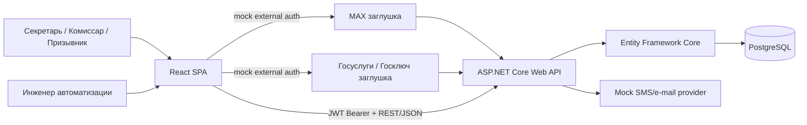
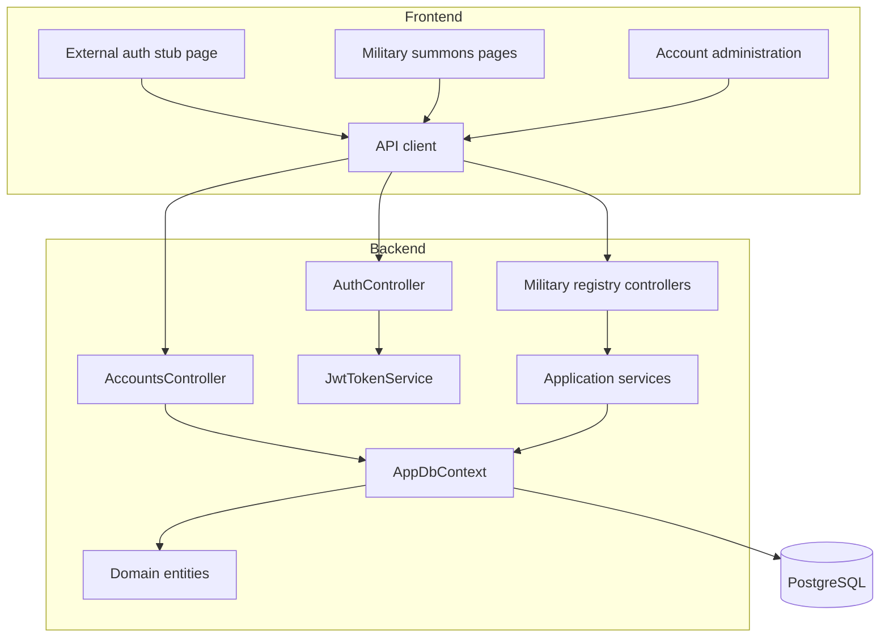

# Архитектура

## Контекст

В реальной целевой схеме MAX и Госуслуги/«Госключ» являются внешними провайдерами аутентификации. В учебной версии их сетевые интеграции **не реализованы**: UI вызывает локальный mock endpoint, который имитирует успешный результат внешней аутентификации и получает JWT.

## Компоненты

## Ролевой доступ

- Operator / Секретарь — рабочие операции реестра;
- Manager / Комиссар — рабочие операции + контроль/аудит;
- Observer / Призывник — чтение;
- AutomationEngineer — создание системных учётных записей.

## Данные

В БД сохраняются призывники, адреса, военкоматы, сотрудники, повестки, история статусов, уведомления, попытки доставки, обращения, документы, audit events и системные учётные записи.

Все seed-данные синтетические.
