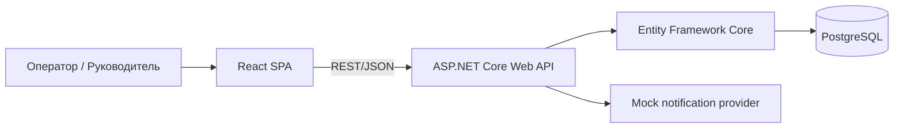
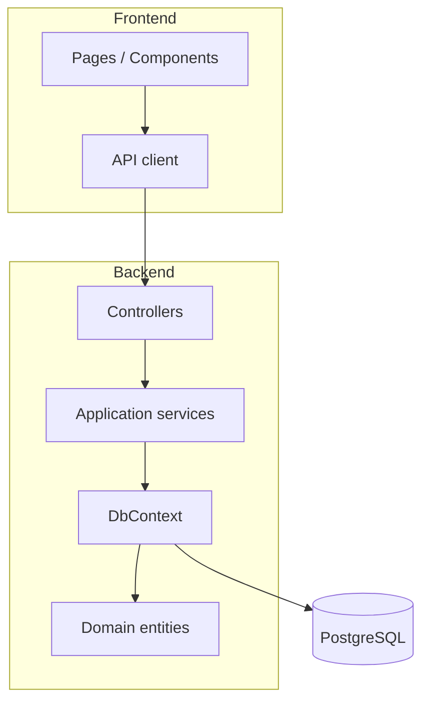

# Архитектура

## Контекст

## Компоненты

## Почему такой стек

- ASP.NET Core и EF Core дают явную объектную модель и удобны для демонстрации принципов ООП.
- PostgreSQL подходит для связной предметной области с транзакциями и ограничениями целостности.
- React + TypeScript обеспечивает независимый frontend и хорошо документируемые контракты.
- Docker Compose минимизирует различия окружения и упрощает запуск на Linux.

## Расширяемость

- `Notification` и `DeliveryAttempt` позволяют подключать разные каналы без изменения сущности повестки.
- статус отделен от истории статусов, поэтому можно строить timeline и аудит.
- документы представлены отдельной сущностью, что позволяет позже вынести бинарное хранилище в S3-совместимый сервис.
- authentication/authorization может быть добавлена через ASP.NET Core Identity и JWT.
