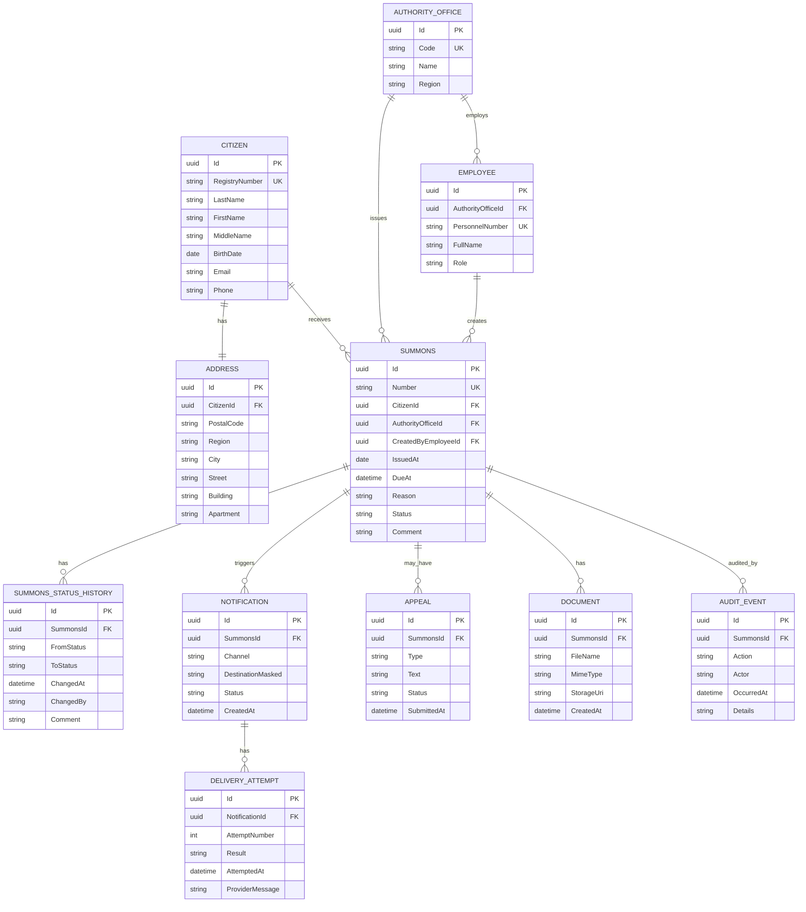

# ERD

В модели 11 доменных сущностей: `Citizen`, `Address`, `AuthorityOffice`, `Employee`, `Summons`, `SummonsStatusHistory`, `Notification`, `DeliveryAttempt`, `Appeal`, `Document`, `AuditEvent`.

