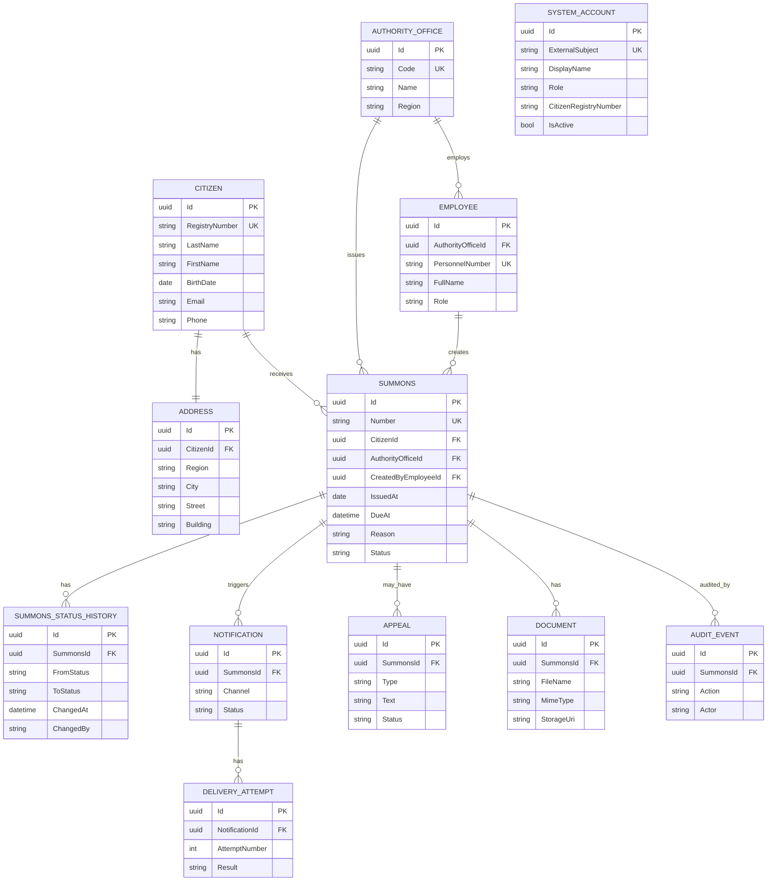

# ERD

В модели 12 сущностей, включая отдельную системную учётную запись для UC-11.

`Citizen` в коде соответствует карточке призывника, а `AuthorityOffice` — военкомату. Эти технические имена сохранены, чтобы не ломать существующую initial migration.
